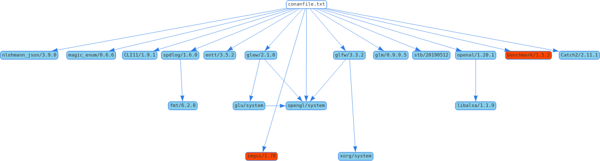

# Game Project - The PURGE

[](https://github.com/Mathieu-Lala/game_project/graphs/commit-activity)
[](https://github.com/Mathieu-Lala/game_project/releases/)

Keimyung University - Mobile Game Development - 2020 Fall Semester

This project is a video game for PC. See the [Game Design Document](doc/ThePURGE_GameDesignDocument.pdf) for more details.

This repository contains the source code of the [game](src/Application) and his [engine](src/Engine).

## Usage

```sh
$> ./tools/launch.sh -- --help
ThePURGE 0.3.0
Usage: ./engine_main [OPTIONS]

Options:
  -h,--help                     Print this help message and exit
  --version                     Print the version number and exit.
  --config=data/config/app.ini  Read an ini file
  --fullscreen BOOLEAN=1        Launch the window in fullscreen mode.
  --window-width UINT=1024      Width of the window.
  --window-height UINT=768      Height of the window.
  --replay-path TEXT            Path of the events to replay.
  --replay-data TEXT            Json events to replay.
  --data TEXT=data/             Path of the data folder.
  --output-folder TEXT=data/    Path of the generated output.
```

## Screenshots

Application version 0.2.12


Application version 0.1.9


## Installing

### Requirements

* Unix systems

  * g++>=10 || clang>=11
  * cmake>=3.13
  * python>=3.0

* Visual Studio Extension

  * Visual Studio 2019>=16.7
  * Linux CMake extension (see [the documentation](https://docs.microsoft.com/en-us/cpp/linux/cmake-linux-configure?view=vs-2019))
  * python>=3.0

The build **require** an internet connection (download of dependencies if missing).

You can use this command line.

```sh
# Shortcut command
$> sh -c "$(curl -fsSL https://raw.githubusercontent.com/Mathieu-Lala/game_project/develop/tools/install.sh)"

# Or
$> sh -c "$(wget -O- https://raw.githubusercontent.com/Mathieu-Lala/game_project/develop/tools/install.sh)"
```

Or clone and inspect the install script.

```sh
# Cloning the repository
$> git clone git@github.com:Mathieu-Lala/game_project.git

# Go in the project
$> cd game_project

# Installing the required environment (partial)
$> ./tools/install.sh --no-clone
```

### Recommended environment

* Unix systems

  * [ccache](https://ccache.dev/)
  * [cppcheck](http://cppcheck.sourceforge.net/)
  * [clang-tidy](https://clang.llvm.org/extra/clang-tidy/)

* Windows

  * [VS cppcheck extension](https://marketplace.visualstudio.com/items?itemName=Alexium.Cppcheckadd-in)
  * [VS conan extension](https://marketplace.visualstudio.com/items?itemName=conan-io.conan-vs-extension)
  * [VS GLSL extension](https://marketplace.visualstudio.com/items?itemName=DanielScherzer.GLSL)
  * [VS clang-format extension](https://marketplace.visualstudio.com/items?itemName=xaver.clang-format)

## Build and Run

<table>
  <tr>
    <td>master (stable)</td>
    <td>
      <a href="https://github.com/Mathieu-Lala/game_project/actions?query=branch%3Amaster">
        
      </a>
    </td>
    <td>
      <a href="https://travis-ci.com/github/Mathieu-Lala/game_project">
        
      </a>
    </td>
  </tr>
  <tr>
    <td>develop (latest)</td>
    <td>
      <a href="https://github.com/Mathieu-Lala/game_project/actions?query=branch%3Adevelop">
        
      </a>
    </td>
    <td>
      <a href="https://travis-ci.com/github/Mathieu-Lala/game_project">
        
      </a>
    </td>
  </tr>
</table>

* Unix systems

    ```sh
    # Generate the cmake project
    $> ./tools/generate.sh

    # Build all the target
    $> ./tools/build.sh

    # Run the executable
    $> ./tools/launch.sh
    ```

* Visual Studio

See the [Microsoft documentation](https://docs.microsoft.com/en-us/cpp/build/cmake-projects-in-visual-studio?view=msvc-160).

### Package Manager

[conan](https://conan.io/) - [documentation](https://docs.conan.io/en/1.31/)



## Testing

[](https://codecov.io/gh/Mathieu-Lala/game_project)

* [CI](https://en.wikipedia.org/wiki/Continuous_integration)

  1. [Github](https://github.com/Mathieu-Lala/game_project/actions)
  1. [Travis](https://travis-ci.com)

* [Unit tests](https://en.wikipedia.org/wiki/Unit_testing)

* [Golden tests](https://en.wikipedia.org/wiki/Software_testing#Output_comparison_testing)

* [Formatting](https://en.wikipedia.org/wiki/Programming_style)

## Acknowledgement

* Jason Turner's [Weekly Game Project](https://github.com/lefticus/cpp_weekly_game_project)

## Initial Authors

* Mathieu LALA - [github](https://github.com/Mathieu-Lala)
* Benjamin PRAUD - [github](https://github.com/BenjaminPraud)
* Yanis FOUREL - [github](https://github.com/Yanis-F)
* Adil RAJABALY - [github](https://github.com/ADeal24)
* Pierre-Genest ESTRADE - [github](https://github.com/Pierre-Genest)

## License

This software is licensed under the ISC license see [LICENSE](/LICENSE) for further details.
